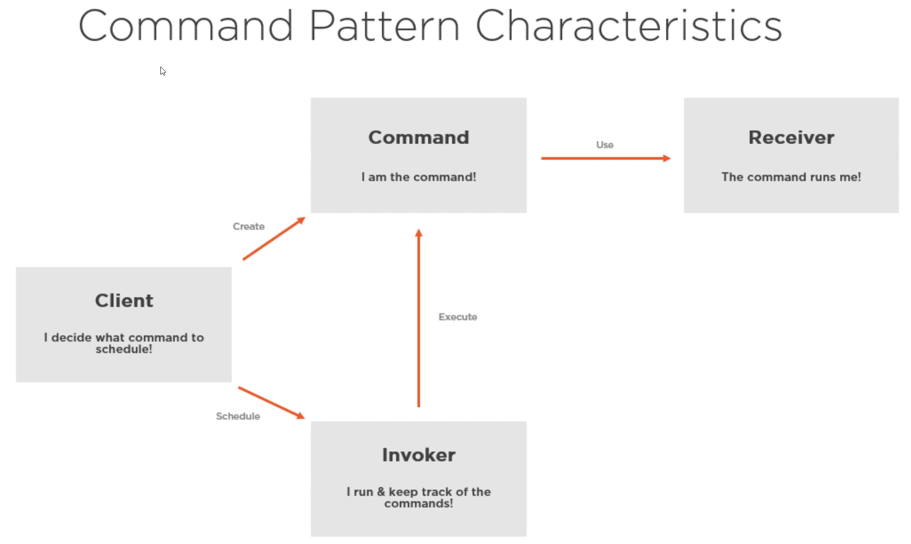
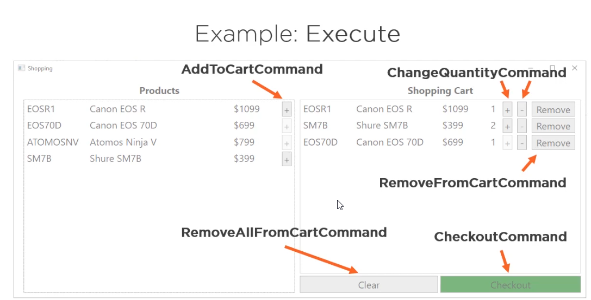
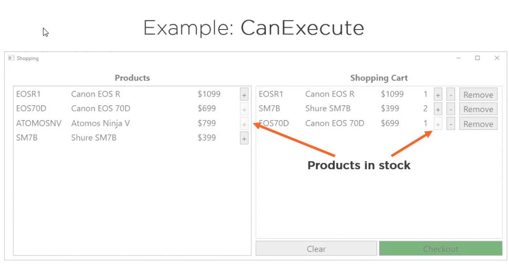

# Command Pattern

## Characteristics

* **Command** (I am the command)
* **Receiver** (the command runs me)
* **Invoker** (I run & keep track of the commands)
* **Client** (I decide what command to schedule)

**A command contains all the data to process the request now or at a later time.**

## Example

AddToCartCommand

* The product which should be added to the cart
* The shopping cart
* A way to check stock availability

The command pattern  can easily be leveraged to allow **undo or redo** functionality.

**Repository pattern** (not covered here) let us work with storage without the consumer having to know about the specific data location (SQL, In-Memory, etc)

## Testing

In a **test** you might use a **Fake/Mock** of the repositories and use that when **creating the commands**

The command pattern adds **complexity** which might **not** always be **desirable**.

With command pattern we get rid of all direct interactions with the repositories allowing better separation of concerns.
